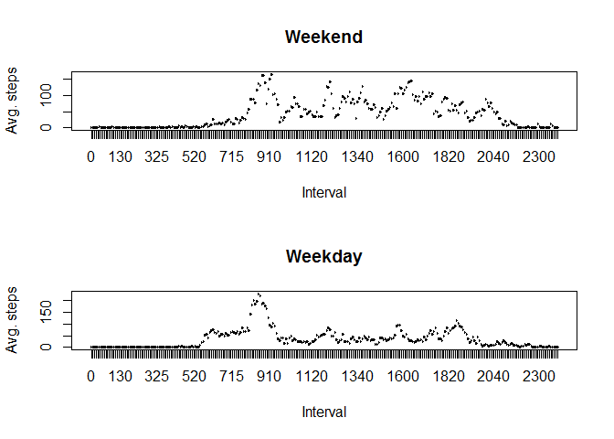

# Reproducible Research: Peer Assessment 1

echo = TRUE

## Loading and preprocessing the data

```r
### Load the data
url <- "https://d396qusza40orc.cloudfront.net/repdata%2Fdata%2Factivity.zip"
download.file(url,"data.zip") ##download the zip file
data <- read.csv(unz("data.zip", filename="activity.csv")) ##unzip and read the csv

### Preprocess data
data$date = as.Date(data$date, format = "%Y-%m-%d") ##set to date class
data$interval = as.factor(data$interval)
```


## 1. What is mean total number of steps taken per day?
First the steps by date are loadaded in the *stepsbydate* variable.
Then the data is plotted to a histogram.


```r
stepsbydate <- aggregate(steps ~ date, data = data, FUN = sum, 
                        na.action = na.omit) ## sum data by date
head(stepsbydate) ##shows the first data items for stepsbydate
```

```
##         date steps
## 1 2012-10-02   126
## 2 2012-10-03 11352
## 3 2012-10-04 12116
## 4 2012-10-05 13294
## 5 2012-10-06 15420
## 6 2012-10-07 11015
```
1.1 The first of the calculated values of steps by date are shown above.


```r
hist(stepsbydate$steps, main = "Histogram of steps by date",
     xlab = "Amount of steps by date") ## Plot a histogram of resulting data
```


```r
### CAlculate mean and median
mean = mean(stepsbydate$steps)
median = median(stepsbydate$steps)
```
1.2 The histogram for total number of steps per day is shown above  

1.3 The mean is 1.0766189\times 10^{4} steps per day, and the median is 10765 steps by day.

## 2. What is the average daily activity pattern?
The data is aggregated by day to plot average daily values. Note values are divided by number of days.


```r
stepsbytime <- aggregate(steps ~ interval, data = data, FUN = sum)

### Sum by date
stepsbytime$meansteps = stepsbytime$steps / nrow(stepsbydate)
plot(stepsbytime$interval, stepsbytime$meansteps, xlab = "Interval",
    ylab = "Steps averaged by day", main = "Daily Activity Pattern", type = "l")
lines(stepsbytime$interval, stepsbytime$meansteps)
```


```r
maxint = which.max(stepsbytime$meansteps)
value = max(stepsbytime$meansteps)
```
2.1 The Interval plot is shown above  

2.2 The interval with the maximum number of steps is interval 104, which has 206.1698113 steps on average.


## 3. Imputing missing values
First we report the number of missing values with the code: 

```r
missing = sum(is.na(data))
```
1.1 There are 2304 missing values.

1.2 Then we segregate the NA values from the data set, assign average interval values to the missing steps values and merge the data with the original data.

```r
library(plyr) ##for using mapvalues function
## mapvalues function is used to easily write the average steps values to each missing entry given the interval number for the entry.

NAs <- data[is.na(data),] ## Segregate NA values
NAs$steps <- mapvalues(NAs$interval, from = levels(data$interval), to = stepsbytime$meansteps) ## return average step values for given interval in "steps" column
NAs$steps = as.numeric(as.character(NAs$steps)) ##save as numeric values
dat2 = data ##create "dat2" variable to contain given and replaced missing vals.
dat2[is.na(data),1] = NAs$steps ##fill missing values
head(dat2)
```

```
##       steps       date interval
## 1 1.7169811 2012-10-01        0
## 2 0.3396226 2012-10-01        5
## 3 0.1320755 2012-10-01       10
## 4 0.1509434 2012-10-01       15
## 5 0.0754717 2012-10-01       20
## 6 2.0943396 2012-10-01       25
```
1.3 As we can observe, missing values have been replaced with average interval values. We can now re-evaluate the data like previously done.


```r
stepsbydate <- aggregate(steps ~ date, data = dat2, FUN = sum, na.action = na.omit) ## sum by date
hist(stepsbydate$steps, main = "Histogram of steps by date", 
     xlab = "Amount of steps by date") ##Plot a histogram of the resulting data
```


```r
## 
mean = mean(stepsbydate$steps)
median = median(stepsbydate$steps)
```

1.4 The mean is 1.0766189\times 10^{4} and the median is 1.0766189\times 10^{4}.


## 4. Are there differences in activity patterns between weekdays and weekends?
1.1 First, the weekend/weekday factor is created by using weekdays() function.


```r
days <- weekdays(dat2$date)##Give name of day
wkend <- c("Saturday", "Sunday")##weekend days
wtest <- days %in% wkend##logical value of weekend or not
dat2$WE <- factor(wtest, labels = c("Weekday","Weekend")) ##Weekend factor var.
```

1.2 Then we plot the results.


```r
## Work with steps by date data to count number of weekdays and weekend days.
idays <- weekdays(stepsbydate$date) ##List of individual day names
n <- length(idays) ## Total number of days
w <- sum(idays %in% wkend) ## Number of weekend days
d <- n-w ## Number of weekdays

## Separate filled in data frame into weekdays (d) and weekend days(w).
datw <- dat2[wtest,] ## Weekend dataset
datd <- dat2[!wtest,] ## Weekday dataset

## Aggregate weekend data for plotting
wstepsbytime <- aggregate(steps ~ interval, data = datw, FUN = sum)
wstepsbytime$meansteps <- wstepsbytime$steps / w

## Aggregate weekday data for plotting
dstepsbytime <- aggregate(steps ~ interval, data = datd, FUN = sum) 
dstepsbytime$meansteps <- dstepsbytime$steps / d

## Generate plot
par(mfrow = c(2,1))
plot(wstepsbytime$interval, wstepsbytime$meansteps, type = "l", 
     xlab = "Interval", ylab = "Avg. steps", 
     main = "Weekend")
plot(dstepsbytime$interval, dstepsbytime$meansteps, type = "l", 
     xlab = "Interval", ylab = "Avg. steps", 
     main = "Weekday")
```



```r
dev.off()
```

```
## null device 
##           1
```
